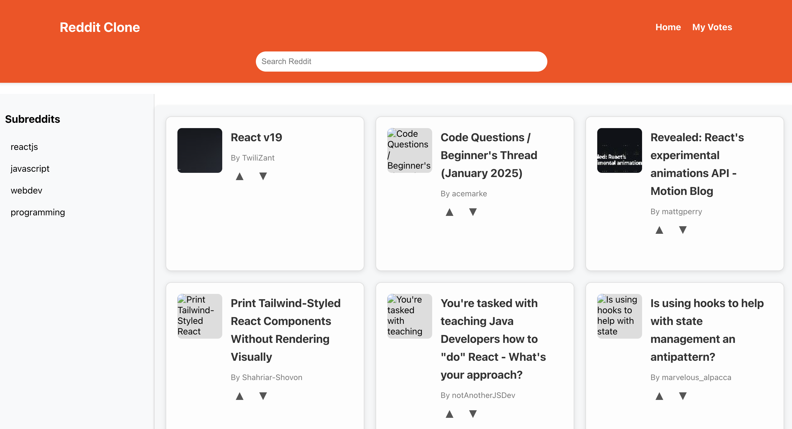
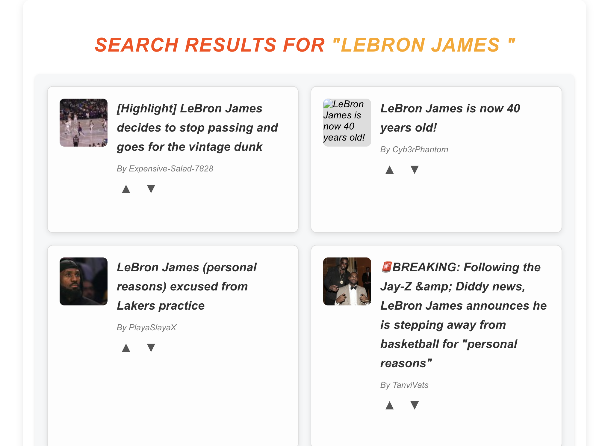
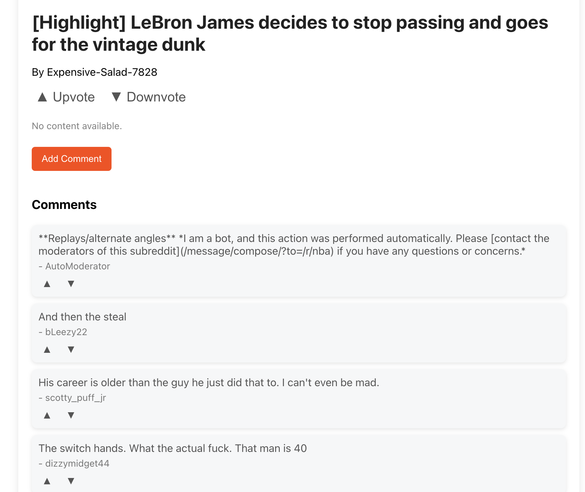
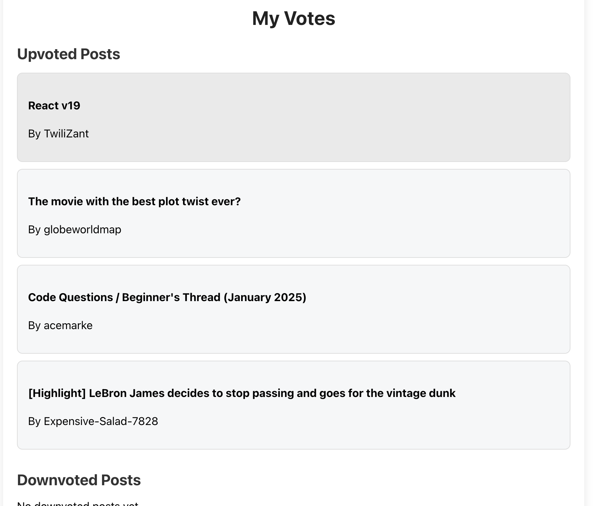
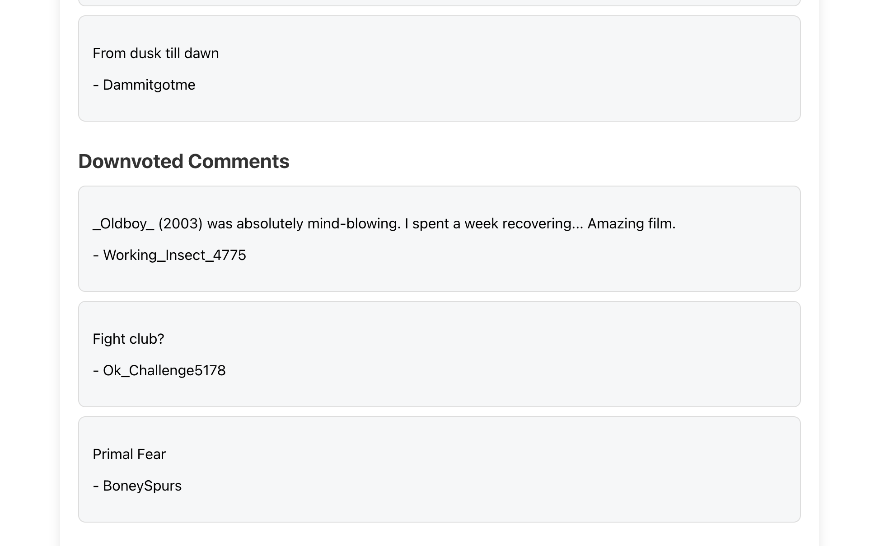

# Reddit Clone App

A Reddit Clone application built with React and Redux that mimics the core functionalities of Reddit. This project allows users to browse posts, search for content, view detailed posts with comments, upvote and downvote posts/comments, and track their votes on a dedicated “My Votes” page. The app leverages the Reddit JSON API to fetch live data and implements a modern, responsive design for an intuitive user experience.

# Features

### Core Functionalities:

	•	Browse Posts: View posts from a default subreddit or search for posts from specific subreddits.
	•	Search: Search for content across Reddit using a built-in search bar.
	•	Post Details: View detailed information about a post, including its comments.
	•	Upvote/Downvote:
		    Upvote and downvote posts directly from the homepage or the post details page.
		    Upvote and downvote comments in the post details page.
	•	Track Votes: A dedicated “My Votes” page displays all upvoted/downvoted posts and comments.

### Additional Features:

	•	Trending Suggestions: A dropdown menu in the search bar shows past searches or trending topics.
	•	Responsive Design: Optimized for desktop and mobile devices.
	•	Dynamic Commenting: Add comments to posts and view them alongside other user comments.
	•	Interactive UI:
		    Visual feedback for upvotes and downvotes.
		    Smooth transitions and modern design elements.

# Technologies Used

	•	Frontend:
		    React
		    Redux
		    React Router
		    Axios
		    Styling:
		    CSS3 with responsive media queries
	•	API:
	    	Reddit JSON API (https://www.reddit.com/r/{subreddit}/.json)
	•	State Management:
	        Redux Toolkit
	•	Development Tools:
	       	Visual Studio Code
	    	Git & GitHub for version control
	    	ESLint & Prettier for code linting and formatting

        
# Setup
Setup Instructions

### Prerequisites

	•	Node.js and npm installed
	•	A code editor (e.g., Visual Studio Code)

### Steps

	1.	Clone the Repository: git clone https://github.com/TommyLau-bit/reddit-lite.git  cd reddit-clone-app

	2.	Install Dependencies: npm install

    3.	Start the Development Server: npm start
#### The app will run locally at http://localhost:3000.

    4.	Build for Production: npm run build

## Features in Action

Browse and Search

	•	View posts from a default subreddit (e.g., reactjs).
	•	Search for specific subreddits or topics.

Post and Comment Details

	•	View full post content with comments.
	•	Add comments dynamically to any post.

Upvote/Downvote

	•	Highlighted buttons indicate active votes.
	•	Votes are tracked on the “My Votes” page.

My Votes Page

	•	Organized layout showing upvoted/downvoted posts and comments.
	•	Clickable links to navigate to individual posts.

## Reddit Clone App

## Features in Action

### Homepage

  
   
  <i>Figure 1: Homepage - Browse posts from the default subreddit, react to posts with upvotes or downvotes, and navigate to post details.</i>

---

### Search Results

  
   
  <i>Figure 2: Search Results - Perform a search and browse posts matching the search query. Upvote or downvote posts directly from the search results page.</i>

---

### Post Details Page

  
   
  <i>Figure 3: Post Details - View a detailed post along with comments. Add new comments and upvote or downvote individual comments.</i>

---

### My Votes Page
#### Upvoted Posts

  
   
  <i>Figure 4: My Votes (Upvoted Posts) - View all posts and comments you have upvoted in a single section for easy reference.</i>

---

#### Downvoted Posts

  
   
  <i>Figure 5: My Votes (Downvoted Posts) - View all posts and comments you have downvoted in a separate section.</i>

Author 👤

Tommy Lau
	•	GitHub: TommyLau-bit